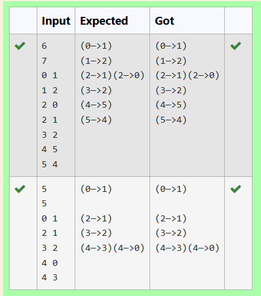

# Ex25 Adjacency List Representation
## DATE: 16//04/2025
## AIM:
To write a C program to represent the given graph using the adjacency list.

## Algorithm
1. Initialize variables:
    Declare n and i as integers.

2. Read the number of vertices:
       Use scanf to read the value of N (number of vertices).
       Use scanf to read the value of n (number of edges).
3. Input edges of the graph:
       Declare an array edges of type struct Edge with size n.
       For each edge i from 0 to n-1:
            Use scanf to read the source vertex edges[i].src.
            Use scanf to read the destination vertex edges[i].dest.
4. Construct the graph:
      Call createGraph(edges, n) to create a graph from the given edges and store the result in graph.
5. Print the graph:
    Call printGraph(graph) to print the adjacency list representation of the graph.
6. End the program:
       Return 0 to indicate successful completion.
## Program:
```
/*
Program to find and display the priority of the operator in the given Postfix expression
Developed by: JAYASREE R
RegisterNumber: 212223230087 
*/

int main(void)
{   int n,i;
    scanf("%d",&N);
    scanf("%d",&n);
    // input array containing edges of the graph (as per the above diagram)
    // (x, y) pair in the array represents an edge from x to y
    struct Edge edges[n];
    for (i = 0; i < n; i++)
    {
        // get the source and destination vertex
        scanf("%d",&edges[i].src);
        scanf("%d",&edges[i].dest);
      
    }
   
    // construct a graph from the given edges
    struct Graph *graph = createGraph(edges, n);
 
    // Function to print adjacency list representation of a graph
    printGraph(graph);
 
    return 0;
}

```

## Output:



## Result:
Thus, the C program to represent the given graph using the adjacency list is implemented successfully
